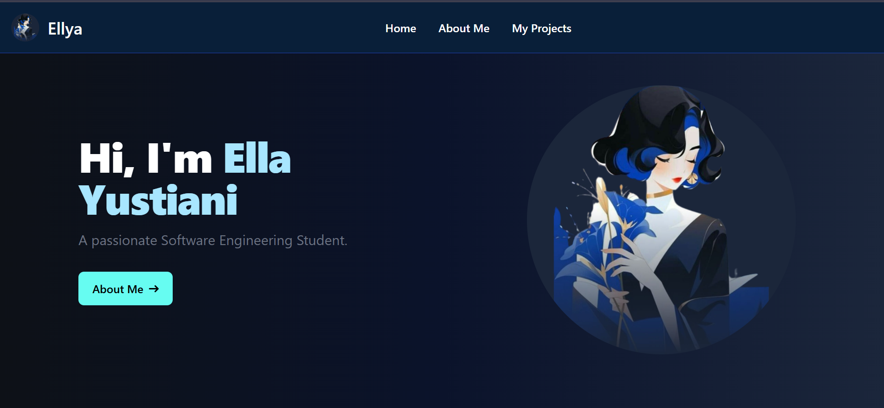
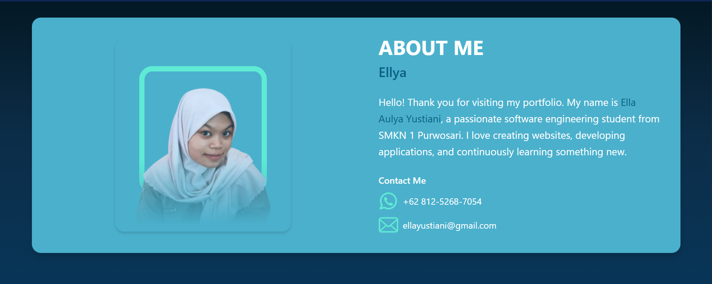
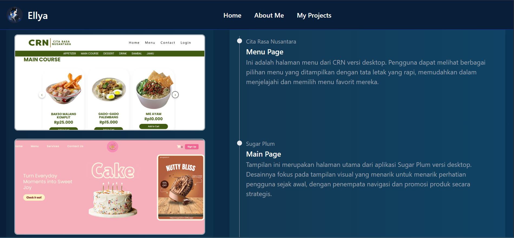

# ✨ My Personal Portfolio - Ella Aulya Yustiani

Welcome to my personal portfolio website! This project is built with **Laravel** for the backend and uses a beautiful, modern frontend designed with **Tailwind CSS**. It showcases who I am, what I do, and some of the projects I've worked on.

---

## 💻 Technologies Used

- **Laravel 10+** – PHP framework for building backend logic
- **Blade Templating** – Simple and powerful frontend rendering
- **Tailwind CSS** – For clean, responsive UI design
- **JavaScript** – For interactivity and effects
- **MySQL** – Database used (if needed)

---

## 📸 Screenshots

| Homepage | About Me | Projects |
|---------|------|-------------|
|  |  |  |

---

## 🧠 What's Inside?

- **About Me Section:** Get to know me through a short story and a timeline of my journey.
- **Skills Section:** Highlighting the tech stack I'm confident in — HTML, CSS, JavaScript, PHP, Laravel, and MySQL.
- **Projects Gallery:** Showcasing selected works I've done, each explained clearly alongside screenshots.
- **Contact Information:** So you can reach out anytime via email or phone.

---

## 📫 Contact Me

- **Email:** ellayustiani@gmail.com  
- **Phone:** +62 812-5268-7054

---

## 🚀 Setup Instructions (Local)

1. Clone the repo:  
   ```bash
   git clone https://github.com/starrynskynight/portfolio.git
